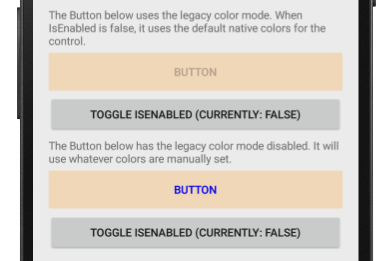

# VisualElement Legacy Color Mode on Android

[ Download the sample](https://developer.xamarin.com/samples/xamarin-forms/userinterface/platformspecifics/)

Some of the Xamarin.Forms views feature a legacy color mode. In this mode, when the [`IsEnabled`](xref:Xamarin.Forms.VisualElement.IsEnabled) property of the view is set to `false`, the view will override the colors set by the user with the default native colors for the disabled state. For backwards compatibility, this legacy color mode remains the default behavior for supported views.

This Android platform-specific disables this legacy color mode, so that colors set on a view by the user remain even when the view is disabled. It's consumed in XAML by setting the [`VisualElement.IsLegacyColorModeEnabled`](xref:Xamarin.Forms.PlatformConfiguration.AndroidSpecific.VisualElement.IsLegacyColorModeEnabledProperty) attached property to `false`:

```xaml
<ContentPage ...
             xmlns:android="clr-namespace:Xamarin.Forms.PlatformConfiguration.AndroidSpecific;assembly=Xamarin.Forms.Core">
    <StackLayout>
        ...
        <Button Text="Button"
                TextColor="Blue"
                BackgroundColor="Bisque"
                android:VisualElement.IsLegacyColorModeEnabled="False" />
        ...
    </StackLayout>
</ContentPage>
```

Alternatively, it can be consumed from C# using the fluent API:

```csharp
using Xamarin.Forms.PlatformConfiguration;
using Xamarin.Forms.PlatformConfiguration.AndroidSpecific;
...

_legacyColorModeDisabledButton.On<Android>().SetIsLegacyColorModeEnabled(false);
```

The `VisualElement.On<Android>` method specifies that this platform-specific will only run on Android. The [`VisualElement.SetIsLegacyColorModeEnabled`](xref:Xamarin.Forms.PlatformConfiguration.AndroidSpecific.VisualElement.SetIsLegacyColorModeEnabled(Xamarin.Forms.IPlatformElementConfiguration{Xamarin.Forms.PlatformConfiguration.Android,Xamarin.Forms.VisualElement},System.Boolean)) method, in the [`Xamarin.Forms.PlatformConfiguration.AndroidSpecific`](xref:Xamarin.Forms.PlatformConfiguration.AndroidSpecific) namespace, is used to control whether the legacy color mode is disabled. In addition, the [`VisualElement.GetIsLegacyColorModeEnabled`](xref:Xamarin.Forms.PlatformConfiguration.AndroidSpecific.VisualElement.GetIsLegacyColorModeEnabled(Xamarin.Forms.IPlatformElementConfiguration{Xamarin.Forms.PlatformConfiguration.Android,Xamarin.Forms.VisualElement})) method can be used to return whether the legacy color mode is disabled.

The result is that the legacy color mode can be disabled, so that colors set on a view by the user remain even when the view is disabled:



> [!NOTE]
> When setting a [`VisualStateGroup`](xref:Xamarin.Forms.VisualStateGroup) on a view, the legacy color mode is completely ignored. For more information about visual states, see [The Xamarin.Forms Visual State Manager](~/xamarin-forms/user-interface/visual-state-manager.md).

## Related links

- [PlatformSpecifics (sample)](https://developer.xamarin.com/samples/xamarin-forms/userinterface/platformspecifics/)
- [Creating Platform-Specifics](~/xamarin-forms/platform/platform-specifics/index.md#creating-platform-specifics)
- [AndroidSpecific API](xref:Xamarin.Forms.PlatformConfiguration.AndroidSpecific)
- [AndroidSpecific.AppCompat API](xref:Xamarin.Forms.PlatformConfiguration.AndroidSpecific.AppCompat)
