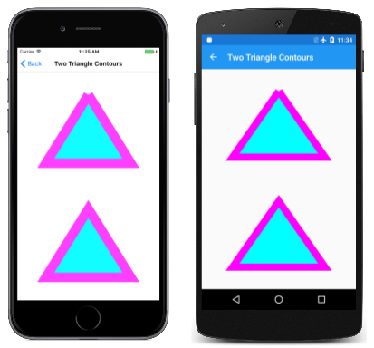
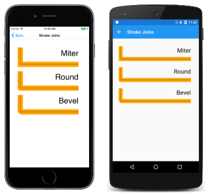

# Path Basics in SkiaSharp

[ Download the sample](https://developer.xamarin.com/samples/xamarin-forms/SkiaSharpForms/Demos/)

_Explore the SkiaSharp SKPath object for combining connected lines and curves_

One of the most important features of the graphics path is the ability to define when multiple lines should be connected and when they should not be connected. The difference can be significant, as the tops of these two triangles demonstrate:


A graphics path is encapsulated by the [`SKPath`](xref:SkiaSharp.SKPath) object. A path is a collection of one or more *contours*. Each contour is a collection of *connected* straight lines and curves. Contours are not connected to each other but they might visually overlap. Sometimes a single contour can overlap itself.

A contour generally begins with a call to the following method of `SKPath`:

- [`MoveTo`](SkiaSharp.SKPath.MoveTo*) to begin a new contour

The argument to that method is a single point, which you can express either as an `SKPoint` value or as separate X and Y coordinates. The `MoveTo` call establishes a point at the beginning of the contour and an initial *current point*. You can call the following methods to continue the contour with a line or curve from the current point to a point specified in the method, which then becomes the new current point:

- [`LineTo`](SkiaSharp.SKPath.LineTo*) to add a straight line to the path
- [`ArcTo`](SkiaSharp.SKPath.ArcTo*) to add an arc, which is a line on the circumference of a circle or ellipse
- [`CubicTo`](SkiaSharp.SKPath.CubicTo*) to add a cubic Bezier spline
- [`QuadTo`](SkiaSharp.SKPath.QuadTo*) to add a quadratic Bezier spline
- [`ConicTo`](SkiaSharp.SKPath.ConicTo*) to add a rational quadratic Bezier spline, which can accurately render conic sections (ellipses, parabolas, and hyperbolas)

None of these five methods contain all the information necessary to describe the line or curve. Each of these five methods works in conjunction with the current point established by the method call immediately preceding it. For example, the `LineTo` method adds a straight line to the contour based on the current point, so the parameter to `LineTo` is only a single point.

The `SKPath` class also defines methods that have the same names as these six methods but with an `R` at the beginning:

- [`RMoveTo`]((SkiaSharp.SKPath.RMoveTo*))
- [`RLineTo`](SkiaSharp.SKPath.RLineTo*)
- [`RArcTo`](SkiaSharp.SKPath.RArcTo*)
- [`RCubicTo`](SkiaSharp.SKPath.RCubicTo*)
- [`RQuadTo`](SkiaSharp.SKPath.RQuadTo*)
- [`RConicTo`](SkiaSharp.SKPath.RConicTo*)

The `R` stands for *relative*. These methods have the same syntax as the corresponding methods without the `R` but are relative to the current point. These are handy for drawing similar parts of a path in a method that you call multiple times.

A contour ends with another call to `MoveTo` or `RMoveTo`, which begins a new contour, or a call to `Close`, which closes the contour. The `Close` method automatically appends a straight line from the current point to the first point of the contour, and marks the path as closed, which means that it will be rendered without any stroke caps.

The difference between open and closed contours is illustrated in the **Two Triangle Contours** page, which uses an `SKPath` object with two contours to render two triangles. The first contour is open and the second is closed. Here's the [`TwoTriangleContoursPage`](https://github.com/xamarin/xamarin-forms-samples/blob/master/SkiaSharpForms/Demos/Demos/SkiaSharpFormsDemos/LinesAndPaths/TwoTriangleContoursPage.cs) class:

```csharp
void OnCanvasViewPaintSurface(object sender, SKPaintSurfaceEventArgs args)
{
    SKImageInfo info = args.Info;
    SKSurface surface = args.Surface;
    SKCanvas canvas = surface.Canvas;

    canvas.Clear();

    // Create the path
    SKPath path = new SKPath();

    // Define the first contour
    path.MoveTo(0.5f * info.Width, 0.1f * info.Height);
    path.LineTo(0.2f * info.Width, 0.4f * info.Height);
    path.LineTo(0.8f * info.Width, 0.4f * info.Height);
    path.LineTo(0.5f * info.Width, 0.1f * info.Height);

    // Define the second contour
    path.MoveTo(0.5f * info.Width, 0.6f * info.Height);
    path.LineTo(0.2f * info.Width, 0.9f * info.Height);
    path.LineTo(0.8f * info.Width, 0.9f * info.Height);
    path.Close();

    // Create two SKPaint objects
    SKPaint strokePaint = new SKPaint
    {
        Style = SKPaintStyle.Stroke,
        Color = SKColors.Magenta,
        StrokeWidth = 50
    };

    SKPaint fillPaint = new SKPaint
    {
        Style = SKPaintStyle.Fill,
        Color = SKColors.Cyan
    };

    // Fill and stroke the path
    canvas.DrawPath(path, fillPaint);
    canvas.DrawPath(path, strokePaint);
}
```

The first contour consists of a call to [`MoveTo`](xref:SkiaSharp.SKPath.MoveTo(System.Single,System.Single)) using X and Y coordinates rather than an `SKPoint` value, followed by three calls to [`LineTo`](xref:SkiaSharp.SKPath.LineTo(System.Single,System.Single)) to draw the three sides of the triangle. The second contour has only two calls to `LineTo` but it finishes the contour with a call to [`Close`](xref:SkiaSharp.SKPath.Close), which closes the contour. The difference is significant:

[](paths-images/twotrianglecontours-large.png#lightbox "Triple screenshot of the Two Triangle Contours page")

As you can see, the first contour is obviously a series of three connected lines, but the end doesn't connect with the beginning. The two lines overlap at the top. The second contour is obviously closed, and was accomplished with one fewer `LineTo` calls because the `Close` method automatically adds a final line to close the contour.

`SKCanvas` defines only one [`DrawPath`](xref:SkiaSharp.SKCanvas.DrawPath(SkiaSharp.SKPath,SkiaSharp.SKPaint)) method, which in this demonstration is called twice to fill and stroke the path. All contours are filled, even those that are not closed. For purposes of filling unclosed paths, a straight line is assumed to exist between the start and end points of the contours. If you remove the last `LineTo` from the first contour, or remove the `Close` call from the second contour, each contour will have only two sides but will be filled as if it were a triangle.

`SKPath` defines many other methods and properties. The following methods add entire contours to the path, which might be closed or not closed depending on the method:

- [`AddRect`](xref:SkiaSharp.SKPath.AddRect*)
- [`AddRoundedRect`](xref:SkiaSharp.SKPath.AddRoundedRect(SkiaSharp.SKRect,System.Single,System.Single,SkiaSharp.SKPathDirection))
- [`AddCircle`](xref:SkiaSharp.SKPath.AddCircle(System.Single,System.Single,System.Single,SkiaSharp.SKPathDirection))
- [`AddOval`](xref:SkiaSharp.SKPath.AddOval(SkiaSharp.SKRect,SkiaSharp.SKPathDirection))
- [`AddArc`](xref:SkiaSharp.SKPath.AddArc(SkiaSharp.SKRect,System.Single,System.Single)) to add a curve on the circumference of an ellipse
- [`AddPath`](xref:SkiaSharp.SKPath.AddPath*) to add another path to the current path
- [`AddPathReverse`](xref:SkiaSharp.SKPath.AddPathReverse(SkiaSharp.SKPath)) to add another path in reverse

Keep in mind that an `SKPath` object defines only a geometry &mdash; a series of points and connections. Only when an `SKPath` is combined with an `SKPaint` object is the path rendered with a particular color, stroke width, and so forth. Also, keep in mind that the `SKPaint` object passed to the `DrawPath` method defines characteristics of the entire path. If you want to draw something requiring several colors, you must use a separate path for each color.

Just as the appearance of the start and end of a line is defined by a stroke cap, the appearance of the connection between two lines is defined by a *stroke join*. You specify this by setting the [`StrokeJoin`](xref:SkiaSharp.SKPaint.StrokeJoin) property of `SKPaint` to a member of the [`SKStrokeJoin`](xref:SkiaSharp.SKStrokeJoin) enumeration:

- `Miter` for a pointy join
- `Round` for a rounded join
- `Bevel` for a chopped-off join

The **Stroke Joins** page shows these three stroke joins with code similar to the **Stroke Caps** page. This is the `PaintSurface` event handler in the [`StrokeJoinsPage`](https://github.com/xamarin/xamarin-forms-samples/blob/master/SkiaSharpForms/Demos/Demos/SkiaSharpFormsDemos/LinesAndPaths/StrokeJoinsPage.cs) class:

```csharp
void OnCanvasViewPaintSurface(object sender, SKPaintSurfaceEventArgs args)
{
    SKImageInfo info = args.Info;
    SKSurface surface = args.Surface;
    SKCanvas canvas = surface.Canvas;

    canvas.Clear();

    SKPaint textPaint = new SKPaint
    {
        Color = SKColors.Black,
        TextSize = 75,
        TextAlign = SKTextAlign.Right
    };

    SKPaint thickLinePaint = new SKPaint
    {
        Style = SKPaintStyle.Stroke,
        Color = SKColors.Orange,
        StrokeWidth = 50
    };

    SKPaint thinLinePaint = new SKPaint
    {
        Style = SKPaintStyle.Stroke,
        Color = SKColors.Black,
        StrokeWidth = 2
    };

    float xText = info.Width - 100;
    float xLine1 = 100;
    float xLine2 = info.Width - xLine1;
    float y = 2 * textPaint.FontSpacing;
    string[] strStrokeJoins = { "Miter", "Round", "Bevel" };

    foreach (string strStrokeJoin in strStrokeJoins)
    {
        // Display text
        canvas.DrawText(strStrokeJoin, xText, y, textPaint);

        // Get stroke-join value
        SKStrokeJoin strokeJoin;
        Enum.TryParse(strStrokeJoin, out strokeJoin);

        // Create path
        SKPath path = new SKPath();
        path.MoveTo(xLine1, y - 80);
        path.LineTo(xLine1, y + 80);
        path.LineTo(xLine2, y + 80);

        // Display thick line
        thickLinePaint.StrokeJoin = strokeJoin;
        canvas.DrawPath(path, thickLinePaint);

        // Display thin line
        canvas.DrawPath(path, thinLinePaint);
        y += 3 * textPaint.FontSpacing;
    }
}
```

Here's the program running:

[](paths-images/strokejoins-large.png#lightbox "Triple screenshot of the Stroke Joins page")

The miter join consists of a sharp point where the lines connect. When two lines join at a small angle, the miter join can become quite long. To prevent excessively long miter joins, the length of the miter join is limited by the value of the [`StrokeMiter`](xref:SkiaSharp.SKPaint.StrokeMiter) property of `SKPaint`. A miter join that exceeds this length is chopped off to become a bevel join.


## Related Links

- [SkiaSharp APIs](https://docs.microsoft.com/dotnet/api/skiasharp)
- [SkiaSharpFormsDemos (sample)](https://developer.xamarin.com/samples/xamarin-forms/SkiaSharpForms/Demos/)
