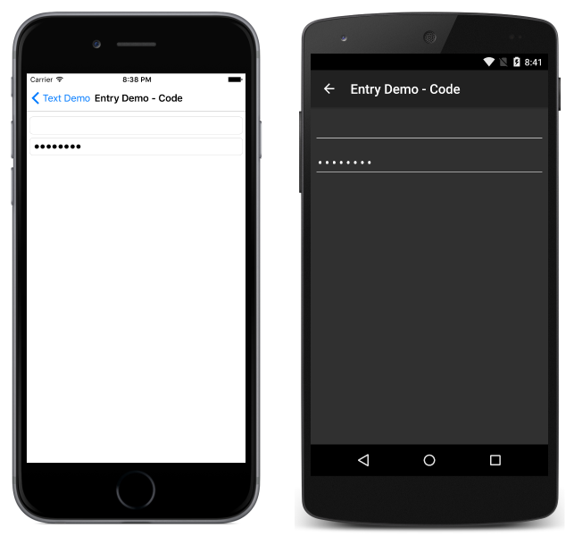
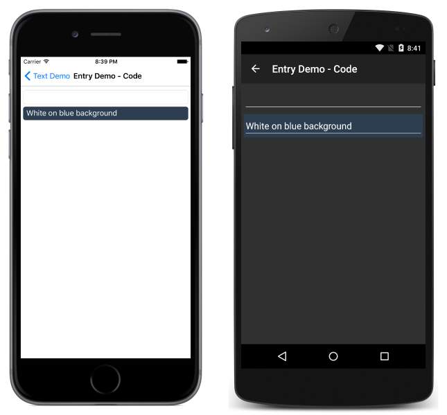

# Xamarin.Forms Entry

[ Download the sample](https://developer.xamarin.com/samples/xamarin-forms/UserInterface/Text)

_Single-line text or password input_

The Xamarin.Forms [`Entry`](xref:Xamarin.Forms.Entry) is used for single-line text input. The `Entry`, like the [`Editor`](xref:Xamarin.Forms.Editor) view, supports multiple keyboard types. Additionally, the `Entry` can be used as a password field.

## Display Customization

### Setting and Reading Text

The `Entry`, like other text-presenting views, exposes the [`Text`](xref:Xamarin.Forms.Entry.Text) property. This property can be used to set and read the text presented by the `Entry`. The following example demonstrates setting the `Text` property in XAML:

```xaml
<Entry Text="I am an Entry" />
```

In C#:

```csharp
var MyEntry = new Entry { Text = "I am an Entry" };
```

To read text, access the `Text` property in C#:

```csharp
var text = MyEntry.Text;
```

### Setting Placeholder Text

The [`Entry`](xref:Xamarin.Forms.Entry) can be set to show placeholder text when it is not storing user input. This is accomplished by setting the [`Placeholder`](xref:Xamarin.Forms.Entry.Placeholder) property to a `string`, and is often used to indicate the type of content that is appropriate for the `Entry`. In addition, the placeholder text color can be controlled by setting the [`PlaceholderColor`](xref:Xamarin.Forms.Entry.PlaceholderColor) property to a [`Color`](xref:Xamarin.Forms.Color):

```xaml
<Entry Placeholder="Username" PlaceholderColor="Olive" />
```

```csharp
var entry = new Entry { Placeholder = "Username", PlaceholderColor = Color.Olive };
```

> [!NOTE]
> The width of an `Entry` can be defined by setting its `WidthRequest` property. Do not depend on the width of an `Entry` being defined based on the value of its `Text` property.

### Limiting Input Length

The [`MaxLength`](xref:Xamarin.Forms.InputView.MaxLength) property can be used to limit the input length that's permitted for the [`Entry`](xref:Xamarin.Forms.Entry). This property should be set to a positive integer:

```xaml
<Entry ... MaxLength="10" />
```

```csharp
var entry = new Entry { ... MaxLength = 10 };
```

A [`MaxLength`](xref:Xamarin.Forms.InputView.MaxLength) property value of 0 indicates that no input will be allowed, and a value of `int.MaxValue`, which is the default value for an [`Entry`](xref:Xamarin.Forms.Entry), indicates that there is no effective limit on the number of characters that may be entered.

### Password Fields

`Entry` provides the `IsPassword` property. When `IsPassword` is `true`, the contents of the field will be presented as black circles:

In XAML:

```xaml
<Entry IsPassword="true" />
```

In C#:

```csharp
var MyEntry = new Entry { IsPassword = true };
```



Placeholders may be used with instances of `Entry` that are configured as password fields:

In XAML:

```xaml
<Entry IsPassword="true" Placeholder="Password" />
```

In C#:

```csharp
var MyEntry = new Entry { IsPassword = true, Placeholder = "Password" };
```


### Setting the Cursor Position and Text Selection Length

The [`CursorPosition`](xref:Xamarin.Forms.Entry.CursorPosition) property can be used to return or set the position at which the next character will be inserted into the string stored in the [`Text`](xref:Xamarin.Forms.Entry.Text) property:

```xaml
<Entry Text="Cursor position set" CursorPosition="5" />
```

```csharp
var entry = new Entry { Text = "Cursor position set", CursorPosition = 5 };
```

The default value of the [`CursorPosition`](xref:Xamarin.Forms.Entry.CursorPosition) property is 0, which indicates that text will be inserted at the start of the `Entry`.

In addition, the [`SelectionLength`](xref:Xamarin.Forms.Entry.SelectionLength) property can be used to return or set the length of text selection within the `Entry`:

```xaml
<Entry Text="Cursor position and selection length set" CursorPosition="2" SelectionLength="10" />
```

```csharp
var entry = new Entry { Text = "Cursor position and selection length set", CursorPosition = 2, SelectionLength = 10 };
```

The default value of the [`SelectionLength`](xref:Xamarin.Forms.Entry.SelectionLength) property is 0, which indicates that no text is selected.

### Customizing the Keyboard

The keyboard that's presented when users interact with an [`Entry`](xref:Xamarin.Forms.Entry) can be set programmatically via the [`Keyboard`](xref:Xamarin.Forms.InputView.Keyboard) property, to one of the following properties from the [`Keyboard`](xref:Xamarin.Forms.Keyboard) class:

- [`Chat`](xref:Xamarin.Forms.Keyboard.Chat) – used for texting and places where emoji are useful.
- [`Default`](xref:Xamarin.Forms.Keyboard.Default) – the default keyboard.
- [`Email`](xref:Xamarin.Forms.Keyboard.Email) – used when entering email addresses.
- [`Numeric`](xref:Xamarin.Forms.Keyboard.Numeric) – used when entering numbers.
- [`Plain`](xref:Xamarin.Forms.Keyboard.Plain) – used when entering text, without any [`KeyboardFlags`](xref:Xamarin.Forms.KeyboardFlags) specified.
- [`Telephone`](xref:Xamarin.Forms.Keyboard.Telephone) – used when entering telephone numbers.
- [`Text`](xref:Xamarin.Forms.Keyboard.Text) – used when entering text.
- [`Url`](xref:Xamarin.Forms.Keyboard.Url) – used for entering file paths & web addresses.

This can be accomplished in XAML as follows:

```xaml
<Entry Keyboard="Chat" />
```

The equivalent C# code is:

```csharp
var entry = new Entry { Keyboard = Keyboard.Chat };
```

Examples of each keyboard can be found in our [Recipes](https://github.com/xamarin/recipes/tree/master/Recipes/xamarin-forms/Controls/choose-keyboard-for-entry) repository.

The [`Keyboard`](xref:Xamarin.Forms.Keyboard) class also has a [`Create`](xref:Xamarin.Forms.Keyboard.Create*) factory method that can be used to customize a keyboard by specifying capitalization, spellcheck, and suggestion behavior. [`KeyboardFlags`](xref:Xamarin.Forms.KeyboardFlags) enumeration values are specified as arguments to the method, with a customized `Keyboard` being returned. The `KeyboardFlags` enumeration contains the following values:

- [`None`](xref:Xamarin.Forms.KeyboardFlags.None) – no features are added to the keyboard.
- [`CapitalizeSentence`](xref:Xamarin.Forms.KeyboardFlags.CapitalizeSentence) – indicates that the first letter of the first word of each entered sentence will be automatically capitalized.
- [`Spellcheck`](xref:Xamarin.Forms.KeyboardFlags.Spellcheck) – indicates that spellcheck will be performed on entered text.
- [`Suggestions`](xref:Xamarin.Forms.KeyboardFlags.Suggestions) – indicates that word completions will be offered on entered text.
- [`CapitalizeWord`](xref:Xamarin.Forms.KeyboardFlags.CapitalizeWord) – indicates that the first letter of each word will be automatically capitalized.
- [`CapitalizeCharacter`](xref:Xamarin.Forms.KeyboardFlags.CapitalizeCharacter) – indicates that every character will be automatically capitalized.
- [`CapitalizeNone`](xref:Xamarin.Forms.KeyboardFlags.CapitalizeNone) – indicates that no automatic capitalization will occur.
- [`All`](xref:Xamarin.Forms.KeyboardFlags.All) – indicates that spellcheck, word completions, and sentence capitalization will occur on entered text.

The following XAML code example shows how to customize the default [`Keyboard`](xref:Xamarin.Forms.Keyboard) to offer word completions and capitalize every entered character:

```xaml
<Entry Placeholder="Enter text here">
    <Entry.Keyboard>
        <Keyboard x:FactoryMethod="Create">
            <x:Arguments>
                <KeyboardFlags>Suggestions,CapitalizeCharacter</KeyboardFlags>
            </x:Arguments>
        </Keyboard>
    </Entry.Keyboard>
</Entry>
```

The equivalent C# code is:

```csharp
var entry = new Entry { Placeholder = "Enter text here" };
entry.Keyboard = Keyboard.Create(KeyboardFlags.Suggestions | KeyboardFlags.CapitalizeCharacter);
```

#### Customizing the Return Key

The appearance of the return key on the soft keyboard, which is displayed when an [`Entry`](xref:Xamarin.Forms.Entry) has focus, can be customized by setting the [`ReturnType`](xref:Xamarin.Forms.Entry.ReturnType) property to a value of the [`ReturnType`](xref:Xamarin.Forms.ReturnType) enumeration:

- [`Default`](xref:Xamarin.Forms.ReturnType.Default) – indicates that no specific return key is required and that the platform default will be used.
- [`Done`](xref:Xamarin.Forms.ReturnType.Done) – indicates a "Done" return key.
- [`Go`](xref:Xamarin.Forms.ReturnType.Go) – indicates a "Go" return key.
- [`Next`](xref:Xamarin.Forms.ReturnType.Next) – indicates a "Next" return key.
- [`Search`](xref:Xamarin.Forms.ReturnType.Search) – indicates a "Search" return key.
- [`Send`](xref:Xamarin.Forms.ReturnType.Send) – indicates a "Send" return key.

The following XAML example shows how to set the return key:

```xaml
<Entry ReturnType="Send" />
```

The equivalent C# code is:

```csharp
var entry = new Entry { ReturnType = ReturnType.Send };
```

> [!NOTE]
> The exact appearance of the return key is dependent upon the platform. On iOS, the return key is a text-based button. However, on the Android and Universal Windows Platforms, the return key is a icon-based button.

When the return key is pressed, the [`Completed`](xref:Xamarin.Forms.Entry.Completed) event fires and any `ICommand` specified by the [`ReturnCommand`](xref:Xamarin.Forms.Entry.ReturnCommand) property is executed. In addition, any `object` specified by the [`ReturnCommandParameter`](xref:Xamarin.Forms.Entry.ReturnCommandParameter) property will be passed to the `ICommand` as a parameter. For more information about commands, see [The Command Interface](~/xamarin-forms/app-fundamentals/data-binding/commanding.md).

### Enabling and Disabling Spell Checking

The [`IsSpellCheckEnabled`](xref:Xamarin.Forms.InputView.IsSpellCheckEnabled) property controls whether spell checking is enabled. By default, the property is set to `true`. As the user enters text, misspellings are indicated.

However, for some text entry scenarios, such as entering a username, spell checking provides a negative experience and should be disabled by setting the [`IsSpellCheckEnabled`](xref:Xamarin.Forms.InputView.IsSpellCheckEnabled) property to `false`:

```xaml
<Entry ... IsSpellCheckEnabled="false" />
```

```csharp
var entry = new Entry { ... IsSpellCheckEnabled = false };
```

> [!NOTE]
> When the [`IsSpellCheckEnabled`](xref:Xamarin.Forms.InputView.IsSpellCheckEnabled) property is set to `false`, and a custom keyboard isn't being used, the native spell checker will be disabled. However, if a [`Keyboard`](xref:Xamarin.Forms.Keyboard) has been set that disables spell checking, such as [`Keyboard.Chat`](xref:Xamarin.Forms.Keyboard.Chat), the `IsSpellCheckEnabled` property is ignored. Therefore, the property cannot be used to enable spell checking for a `Keyboard` that explicitly disables it.

### Enabling and Disabling Text Prediction

The [`IsTextPredictionEnabled`](xref:Xamarin.Forms.Entry.IsTextPredictionEnabled) property controls whether text prediction and automatic text correction is enabled. By default, the property is set to `true`. As the user enters text, word predictions are presented.

However, for some text entry scenarios, such as entering a username, text prediction and automatic text correction provides a negative experience and should be disabled by setting the [`IsTextPredictionEnabled`](xref:Xamarin.Forms.Entry.IsTextPredictionEnabled) property to `false`:

```xaml
<Entry ... IsTextPredictionEnabled="false" />
```

```csharp
var entry = new Entry { ... IsTextPredictionEnabled = false };
```

> [!NOTE]
> When the [`IsTextPredictionEnabled`](xref:Xamarin.Forms.Entry.IsTextPredictionEnabled) property is set to `false`, and a custom keyboard isn't being used, text prediction and automatic text correction is disabled. However, if a [`Keyboard`](xref:Xamarin.Forms.Keyboard) has been set that disables text prediction, the `IsTextPredictionEnabled` property is ignored. Therefore, the property cannot be used to enable text prediction for a `Keyboard` that explicitly disables it.

### Colors

Entry can be set to use a custom background and text colors via the following bindable properties:

- **TextColor** &ndash; sets the color of the text.
- **BackgroundColor** &ndash; sets the color shown behind the text.

Special care is necessary to ensure that colors will be usable on each platform. Because each platform has different defaults for text and background colors, you'll often need to set both if you set one.

Use the following code to set the text color of an entry:

In XAML:

```xaml
<Entry TextColor="Green" />
```

In C#:

```csharp
var entry = new Entry();
entry.TextColor = Color.Green;
```


Note that the placeholder is not affected by the specified `TextColor`.

To set the background color in XAML:

```xaml
<Entry BackgroundColor="#2c3e50" />
```

In C#:

```csharp
var entry = new Entry();
entry.BackgroundColor = Color.FromHex("#2c3e50");
```



Be careful to make sure that the background and text colors you choose are usable on each platform and don't obscure any placeholder text.

## Events and Interactivity

Entry exposes two events:

- [`TextChanged`](xref:Xamarin.Forms.Entry.TextChanged) &ndash; raised when the text changes in the entry. Provides the text before and after the change.
- [`Completed`](xref:Xamarin.Forms.Entry.Completed) &ndash; raised when the user has ended input by pressing the return key on the keyboard.

### Completed

The `Completed` event is used to react to the completion of an interaction with an Entry. `Completed` is raised when the user ends input with a field by pressing the return key on the keyboard. The handler for the event is a generic event handler, taking the sender and `EventArgs`:

```csharp
void Entry_Completed (object sender, EventArgs e)
{
    var text = ((Entry)sender).Text; //cast sender to access the properties of the Entry
}
```

The completed event can be subscribed to in XAML:

```xaml
<Entry Completed="Entry_Completed" />
```

and C#:

```csharp
var entry = new Entry ();
entry.Completed += Entry_Completed;
```

After the [`Completed`](xref:Xamarin.Forms.Entry.Completed) event fires, any `ICommand` specified by the [`ReturnCommand`](xref:Xamarin.Forms.Entry.ReturnCommand) property is executed, with the `object` specified by the [`ReturnCommandParameter`](xref:Xamarin.Forms.Entry.ReturnCommandParameter) property being passed to the `ICommand`.

### TextChanged

The `TextChanged` event is used to react to a change in the content of a field.

`TextChanged` is raised whenever the `Text` of the `Entry` changes. The handler for the event takes an instance of `TextChangedEventArgs`. `TextChangedEventArgs` provides access to the old and new values of the `Entry` `Text` via the `OldTextValue` and `NewTextValue` properties:

```csharp
void Entry_TextChanged (object sender, TextChangedEventArgs e)
{
    var oldText = e.OldTextValue;
    var newText = e.NewTextValue;
}
```

The `TextChanged` event can be subscribed to in XAML:

```xaml
<Entry TextChanged="Entry_TextChanged" />
```

and C#:

```csharp
var entry = new Entry ();
entry.TextChanged += Entry_TextChanged;
```


## Related Links

- [Text (sample)](https://developer.xamarin.com/samples/xamarin-forms/UserInterface/Text)
- [Entry API](xref:Xamarin.Forms.Entry)
