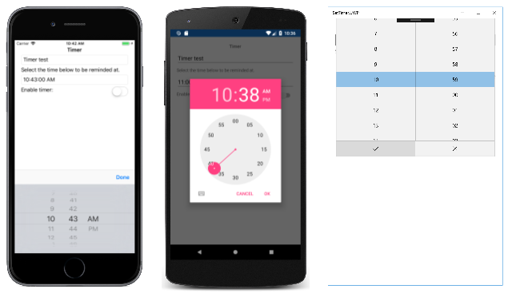
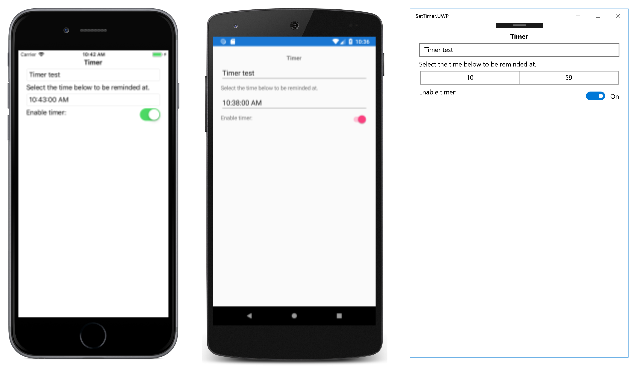
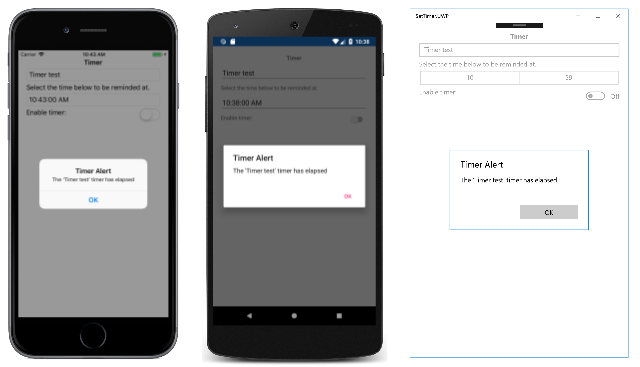

# Xamarin.Forms TimePicker

[ Download the sample](https://developer.xamarin.com/samples/xamarin-forms/UserInterface/TimePicker/)

_A Xamarin.Forms view that allows the user to select a time._

The Xamarin.Forms [`TimePicker`](xref:Xamarin.Forms.TimePicker) invokes the platform's time-picker control and allows the user to select a time. `TimePicker` defines the following properties:

- [`Time`](xref:Xamarin.Forms.TimePicker.Time) of type `TimeSpan`, the selected time, which defaults to a `TimeSpan` of 0. The `TimeSpan` type indicates a duration of time since midnight.
- [`Format`](xref:Xamarin.Forms.TimePicker.Format) of type `string`, a [standard](/dotnet/standard/base-types/standard-date-and-time-format-strings/) or [custom](/dotnet/standard/base-types/custom-date-and-time-format-strings/) .NET formatting string, which defaults to "t", the short time pattern.
- [`TextColor`](xref:Xamarin.Forms.TimePicker.TextColor) of type [`Color`](xref:Xamarin.Forms.Color), the color used to display the selected time, which defaults to [`Color.Default`](xref:Xamarin.Forms.Color.Default).
- [`FontAttributes`](xref:Xamarin.Forms.TimePicker.FontAttributes) of type [`FontAttributes`](xref:Xamarin.Forms.FontAttributes), which defaults to [`FontAtributes.None`](xref:Xamarin.Forms.FontAttributes.None).
- [`FontFamily`](xref:Xamarin.Forms.TimePicker.FontFamily) of type `string`, which defaults to `null`.
- [`FontSize`](xref:Xamarin.Forms.TimePicker.FontSize) of type `double`, which defaults to -1.0.

All of these properties are backed by [`BindableProperty`](xref:Xamarin.Forms.BindableProperty) objects, which means that they can be styled, and the properties can be targets of data bindings. The [`Time`](xref:Xamarin.Forms.TimePicker.Time) property has a default binding mode of [`BindingMode.TwoWay`](xref:Xamarin.Forms.BindingMode.TwoWay), which means that it can be a target of a data binding in an application that uses the [Model-View-ViewModel (MVVM)](~/xamarin-forms/enterprise-application-patterns/mvvm.md) architecture.

The [`TimePicker`](xref:Xamarin.Forms.TimePicker) doesn't include an event to indicate a new selected [`Time`](xref:Xamarin.Forms.TimePicker.Time) value. If you need to be notified of this, you can add a handler for the [`PropertyChanged`](xref:Xamarin.Forms.BindableObject.PropertyChanged) event.

## Initializing the Time property

In code, you can initialize the [`Time`](xref:Xamarin.Forms.TimePicker.Time) property to a value of type `TimeSpan`:

```csharp
TimePicker timePicker = new TimePicker
{
  Time = new TimeSpan(4, 15, 26) // Time set to "04:15:26"
};
```

When the [`Time`](xref:Xamarin.Forms.TimePicker.Time) property is specified in XAML, the value is converted to a `TimeSpan` and validated to ensure that the number of milliseconds is greater than or equal to 0, and that the number of hours is less than 24. The time components should be separated by colons:

```xaml
<TimePicker Time="4:15:26" />
```

If the [`BindingContext`](xref:Xamarin.Forms.BindableObject.BindingContext) property of [`TimePicker`](xref:Xamarin.Forms.TimePicker) is set to an instance of a ViewModel containing a property of type `TimeSpan` named `SelectedTime` (for example), you can instantiate the `TimePicker` like this:

```xaml
<TimePicker Time="{Binding SelectedTime}" />
```

In this example, the [`Time`](xref:Xamarin.Forms.TimePicker.Time) property is initialized to the `SelectedTime` property in the ViewModel. Because the `Time` property has a binding mode of [`TwoWay`](xref:Xamarin.Forms.BindingMode.TwoWay), any new time that the user selects is automatically propagated to the ViewModel.

If the [`TimePicker`](xref:Xamarin.Forms.TimePicker) does not contain a binding on its [`Time`](xref:Xamarin.Forms.TimePicker.Time) property, an application should attach a handler to the [`PropertyChanged`](xref:Xamarin.Forms.BindableObject.PropertyChanged) event to be informed when the user selects a new time.

For information about setting font properties, see [Fonts](~/xamarin-forms/user-interface/text/fonts.md).

## TimePicker and layout

It's possible to use an unconstrained horizontal layout option such as `Center`, `Start`, or `End` with [`TimePicker`](xref:Xamarin.Forms.TimePicker):

```xaml
<TimePicker ···
            HorizontalOptions="Center"
            ··· />
```

However, this is not recommended. Depending on the setting of the [`Format`](xref:Xamarin.Forms.TimePicker.Format) property, selected times might require different display widths. For example, the "T" format string causes the [`TimePicker`](xref:Xamarin.Forms.TimePicker) view to display times in a long format, and "4:15:26 AM" requires a greater display width than the short time format ("t") of "4:15 AM". Depending on the platform, this difference might cause the `TimePicker` view to change width in layout, or for the display to be truncated.

> [!TIP]
> It's best to use the default `HorizontalOptions` setting of `Fill` with [`TimePicker`](xref:Xamarin.Forms.TimePicker), and not to use a width of `Auto` when putting `TimePicker` in a `Grid` cell.

## TimePicker in an application

The [**SetTimer**](https://developer.xamarin.com/samples/xamarin-forms/UserInterface/TimePicker/) sample includes [`TimePicker`](xref:Xamarin.Forms.TimePicker), [`Entry`](xref:Xamarin.Forms.Entry), and [`Switch`](xref:Xamarin.Forms.Switch) views on its page. The `TimePicker` can be used to select a time, and when that time occurs an alert dialog is displayed that reminds the user of the text in the `Entry`, provided the `Switch` is toggled on. Here's the XAML file:

```xaml
<ContentPage xmlns="http://xamarin.com/schemas/2014/forms"
             xmlns:x="http://schemas.microsoft.com/winfx/2009/xaml"
             xmlns:local="clr-namespace:SetTimer"
             x:Class="SetTimer.MainPage">
    <StackLayout>
        ...
        <Entry x:Name="_entry"
               Placeholder="Enter event to be reminded of" />
        <Label Text="Select the time below to be reminded at." />
        <TimePicker x:Name="_timePicker"
                    Time="11:00:00"
                    Format="T"
                    PropertyChanged="OnTimePickerPropertyChanged" />
        <StackLayout Orientation="Horizontal">
            <Label Text="Enable timer:" />
            <Switch x:Name="_switch"
                    HorizontalOptions="EndAndExpand"
                    Toggled="OnSwitchToggled" />
        </StackLayout>
    </StackLayout>
</ContentPage>
```

The [`Entry`](xref:Xamarin.Forms.Entry) lets you enter reminder text that will be displayed when the selected time occurs. The [`TimePicker`](xref:Xamarin.Forms.TimePicker) is assigned a [`Format`](xref:Xamarin.Forms.TimePicker.Format) property of "T" for long time format. It has an event handler attached to the [`PropertyChanged`](xref:Xamarin.Forms.BindableObject.PropertyChanged) event, and the [`Switch`](xref:Xamarin.Forms.Switch) has a handler attached to its [`Toggled`](xref:Xamarin.Forms.Switch.Toggled) event. These events handlers are in the code-behind file and call the `SetTriggerTime` method:

```csharp
public partial class MainPage : ContentPage
{
    DateTime _triggerTime;

    public MainPage()
    {
        InitializeComponent();

        Device.StartTimer(TimeSpan.FromSeconds(1), OnTimerTick);
    }

    bool OnTimerTick()
    {
        if (_switch.IsToggled && DateTime.Now >= _triggerTime)
        {
            _switch.IsToggled = false;
            DisplayAlert("Timer Alert", "The '" + _entry.Text + "' timer has elapsed", "OK");
        }
        return true;
    }

    void OnTimePickerPropertyChanged(object sender, PropertyChangedEventArgs args)
    {
        if (args.PropertyName == "Time")
        {
            SetTriggerTime();
        }
    }

    void OnSwitchToggled(object sender, ToggledEventArgs args)
    {
        SetTriggerTime();
    }

    void SetTriggerTime()
    {
        if (_switch.IsToggled)
        {
            _triggerTime = DateTime.Today + _timePicker.Time;
            if (_triggerTime < DateTime.Now)
            {
                _triggerTime += TimeSpan.FromDays(1);
            }
        }
    }
}
```

The `SetTriggerTime` method calculates a timer time based on the `DateTime.Today` property value and the `TimeSpan` value returned from the [`TimePicker`](xref:Xamarin.Forms.TimePicker). This is necessary because the `DateTime.Today` property returns a `DateTime` indicating the current date, but with a time of midnight. If the timer time has already passed today, then it's assumed to be tomorrow.

The timer ticks every second, executing the `OnTimerTick` method that checks whether the [`Switch`](xref:Xamarin.Forms.Switch) is on and whether the current time is greater than or equal to the timer time. When the timer time occurs, the [`DisplayAlert`](xref:Xamarin.Forms.Page.DisplayAlert*) method presents an alert dialog to the user as a reminder.

When the sample is first run, the [`TimePicker`](xref:Xamarin.Forms.TimePicker) view is initialized to 11am. Tapping the `TimePicker` invokes the platform time picker. The platforms implement the time picker in very different ways, but each approach is familiar to users of that platform:

[](timepicker-images/timepicker-open-large.png#lightbox "Select Time")

> [!TIP]
> On Android, the [`TimePicker`](xref:Xamarin.Forms.TimePicker) dialog can be customized by overriding the `CreateTimePickerDialog` method in a custom renderer. This allows, for example, additional buttons to be added to the dialog.

After selecting a time, the selected time is displayed in the [`TimePicker`](xref:Xamarin.Forms.TimePicker):

[](timepicker-images/timepicker-selected-large.png#lightbox "Time Selected")

Provided that the [`Switch`](xref:Xamarin.Forms.Switch) is toggled to the on position, the application displays an alert dialog reminding the user of the text in the [`Entry`](xref:Xamarin.Forms.Entry) when the selected time occurs:

[](timepicker-images/timer-test-large.png#lightbox "Timer Popup")

As soon as the alert dialog is displayed, the [`Switch`](xref:Xamarin.Forms.Switch) is toggled to the off position.

## Related links

- [SetTimer sample](https://developer.xamarin.com/samples/xamarin-forms/UserInterface/TimePicker/)
- [TimePicker API](xref:Xamarin.Forms.TimePicker)
